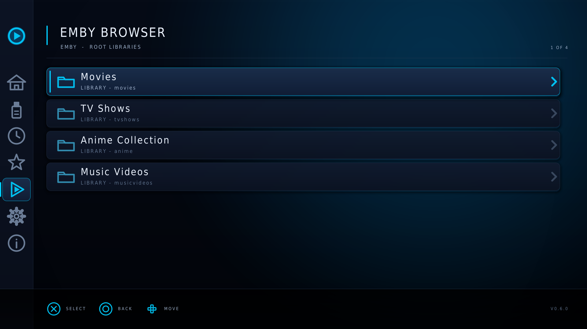
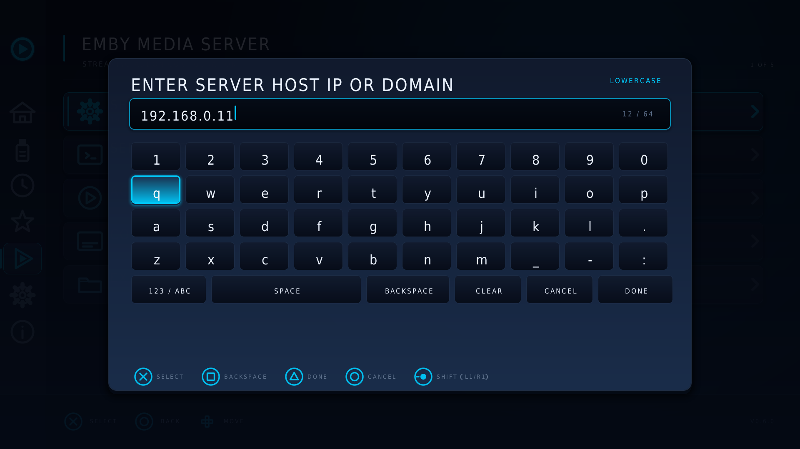
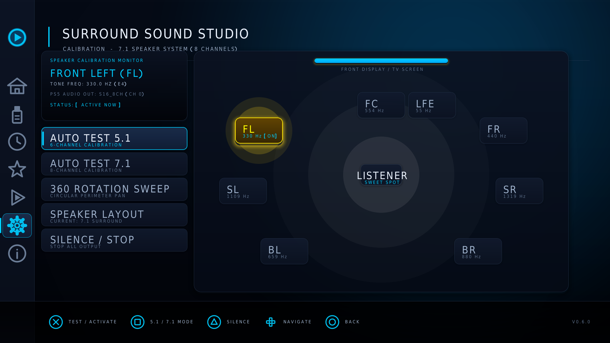

# EVO Player

**A media player for jailbroken PS5 on firmware 12.70.**

Plays your video off a USB drive or streams directly from your local **Emby** media server, featuring full 5.1 / 7.1 surround sound, subtitles, resume support, an acoustic calibration studio, and a television-first UI built specifically for the DualSense controller.


---

## Installation Guide

The recommended way to install and use EVO Player is via the **Media Tile Launcher** (`InstallTile.elf`), which embeds the player and registers an official tile directly in your PS5's **Media** home screen.

### Prerequisites

- A PS5 running firmware **12.70**, jailbroken with `ps5-payload-elfldr` active.
- Access to a **payload manager** (such as the on-console web payload manager, typically at `http://<your-ps5-ip>:8084` or `prospero-deploy`).
- *(Optional for USB playback)* A USB stick formatted as **exFAT** or **FAT32** plugged into `/mnt/usb0`.
- *(Optional for Emby)* An active Emby server reachable on your local area network (LAN).

---

### Method 1: Media Tile Installation (`InstallTile.elf`) — Recommended

1. Download **`EVOPlayer-*-InstallTile.elf`** from the latest **[GitHub Release](https://github.com/sainsaji/EVO-PLAYER-PS5/releases/latest)**.
2. Copy `EVOPlayer-*-InstallTile.elf` to your USB stick or send it directly over your network using your payload manager (`http://<your-ps5-ip>:8084` or `tools/launch.sh`).
3. Execute the payload. The installer registers the application into `/system_ex/app/` and `/user/app/` and displays:
   > **"EVO Player ready in Media"**
4. Press the **PS Button**, navigate to the **Media** tab on the PS5 home screen, and launch **EVO Player**.

> [!IMPORTANT]
> **Leave the tile payload resident.** The launcher stays resident in the background to handle display planes and app launch handoffs. **Re-run the payload after every console reboot** alongside your jailbreak.

---

### Method 2: Web Server / USB Homebrew (`homebrew.zip`)

If you prefer launching homebrew via `ps5-payload-websrv` rather than registering a Media tile:

1. Download **`EVOPlayer-*-homebrew.zip`** from the release.
2. Extract the contents directly to the root of your USB drive so the path is `/homebrew/EVOPlayer/eboot.elf`.
3. Connect the USB drive to the console, open `http://<your-ps5-ip>:8080/index.html` in a browser, and click **EVOPlayer**.

---

### Release Package Matrix

| File | Type | How to use |
|---|---|---|
| **`EVOPlayer-*-InstallTile.elf`** | **Media Tile Installer** | **Standard install.** Send to payload manager (port 8084) $\to$ opens from Media tab |
| **`EVOPlayer-*-UninstallTile.elf`** | **Tile Uninstaller** | Removes the EVO Player tile from the Media home screen |
| **`EVOPlayer-*-homebrew.zip`** | **Websrv Bundle** | Extract to `/homebrew/EVOPlayer/` on USB $\to$ launch from port 8080 |
| **`EVOPlayer-*-player-only.elf`** | **Bare Payload** | For direct websrv / `/data/homebrew` usage. **Do not send directly to raw elfldr** (runs headless without `hbldr`) |

---

## Features

### Browse USB & Stream from Emby Server

Browse local video files from `/mnt/usb0` with real-time metadata inspector (codecs, resolution, file size, duration) or connect directly to your local **Emby Server**. Browse libraries, seasons, and episodes with server-cached cover posters and backdrops, and stream directly over LAN with synchronized watch progress.




### On-Screen Virtual Keyboard

Built-in controller-friendly on-screen keyboard for setting up network endpoints, server ports, usernames, and passwords. Supports lowercase, uppercase, digits, and special symbols with instant controller shortcuts ($\square$ for Backspace, $\Delta$ for Done, $\bigcirc$ for Cancel).



### Surround Sound Studio (5.1 & 7.1 Calibration)

A bespoke 360° top-down acoustic sound stage interface for verifying multichannel audio setups.
- Real-time hardware test over PS5 8-channel audio (`S16_8CH`).
- Smooth 50ms attack/decay envelope fades to prevent popping or clicking.
- Individual speaker tone tests for `FL`, `FC`, `FR`, `LFE`, `SL`, `SR`, `BL`, and `BR`.
- Automated **5.1 & 7.1 Auto-Test Sequences** and a continuous **360° Perimeter Rotation Sweep**.
- Dynamic 5.1 layout mode that hides inactive side speakers and seamlessly updates 2D spatial D-pad navigation.



### Smart Subtitle Selection & Sizing

Subtitle tracks are ranked and ordered by real cue counts rather than claimed metadata. Includes a persistent default subtitle size configuration (`SMALL`, `MEDIUM`, `LARGE`) in Settings, and real-time synchronization offset adjustment ($L2$/$R2$) during playback.


### Text Document Reader

Open `.txt`, `.log`, `.md`, `.nfo`, `.json`, and subtitle documents directly in the built-in reader with custom typography, punctuation atlas, and adjustable text sizes.


### Structured Settings & Custom Themes

Organized sub-menus for Playback & Video, Subtitles, Interface, System Hardware, and Developer Tools. Includes 4 built-in color themes plus support for external `.theme` files placed in `/mnt/usb0/evo_themes`.


---

## Controls

| Button | In Menus & Browser | During Video Playback | In Keyboard Modal |
|---|---|---|---|
| **CROSS ($\times$)** | Select / Open | Pause / Resume | Type Character |
| **CIRCLE ($\bigcirc$)** | Back / Return | Stop (with prompt) | Cancel / Close |
| **TRIANGLE ($\Delta$)** | Toggle Favorite | Aspect Ratio (Fit / Fill / Stretch) | Submit / Done |
| **SQUARE ($\square$)** | File Details / Inspector | — | Backspace |
| **D-Pad / Stick** | Move focus, hold to scroll | — | Move cursor |
| **LEFT** | Open side navigation rail | — | — |
| **DOWN** | — | Subtitle track picker | — |
| **L1 / R1** | Page scroll | Skip chapter / ±60s | Switch Shift / Symbols |
| **L2 / R2** | Jump alphabetical (A–Z) | Subtitle sync nudge (±50ms) | — |
| **L3** | Screenshot capture | Screenshot capture | — |

---

## Building from Source

Builds are fully containerized using the pinned Docker toolchain:

```bash
git clone https://github.com/sainsaji/EVO-PLAYER-PS5
cd EVO-PLAYER-PS5
echo "PS5_HOST=192.168.0.10" > .env      # your console's IP

docker compose build                     # build container image
docker compose run --rm ps5-dev ./scripts/build-evoplayer.sh
```

To build all release payloads (including Media tile and homebrew bundle):
```bash
docker compose run --rm ps5-dev ./scripts/build-media-tile.sh
docker compose run --rm ps5-dev ./scripts/package-pkg.sh --format homebrew output/elf/EVOPlayer.elf
```

To render all UI screens offline on PC:
```bash
./tools/uiview.sh --all                  # renders PNGs to output/uiview/
```

---

## Documentation

| Document | Purpose |
|---|---|
| [docs/building.md](docs/building.md) | Full build, environment, and packaging guide |
| [docs/addons-emby-nuvio.md](docs/addons-emby-nuvio.md) | Technical architecture and specs for Emby & streaming add-ons |
| [docs/architecture.md](docs/architecture.md) | Code architecture, video pipelines, and draw vtables |
| [docs/ui-handoff.md](docs/ui-handoff.md) | UI system, design tokens, and layout guidelines |
| [docs/converter-perf.md](docs/converter-perf.md) | 4K/1080p video converter benchmarks and metrics |
| [docs/theming.md](docs/theming.md) | Theme format specifications and tokens |
| [docs/tooling.md](docs/tooling.md) | Launcher safety cooldowns and CLI utilities |
| [CHANGELOG.md](CHANGELOG.md) | Version history and release notes |

---

## Credits & License

Forked from [ProsperoPlayer](https://github.com/KINGDKAK/ProsperoPlayer) by KINGDKAK and licensed under **GPL-3.0-or-later** (see [COPYRIGHT.md](COPYRIGHT.md)).

- [ps5-payload-dev](https://github.com/ps5-payload-dev) (John Törnblom) — SDK, elfldr, websrv
- [KINGDKAK](https://github.com/KINGDKAK) — ProsperoPlayer
- [zecoxao/sce_symbols](https://github.com/zecoxao/sce_symbols) — NID symbol database

*EVO Player is independent homebrew software and is not affiliated with, endorsed by, or associated with Sony Interactive Entertainment. All PlayStation trademarks belong to their respective owners.*
