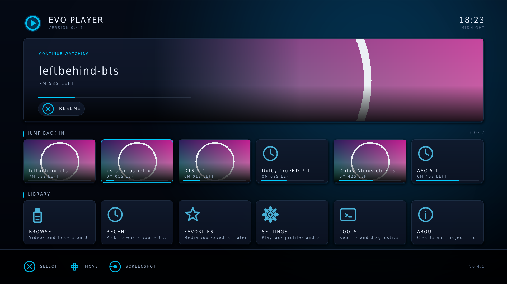
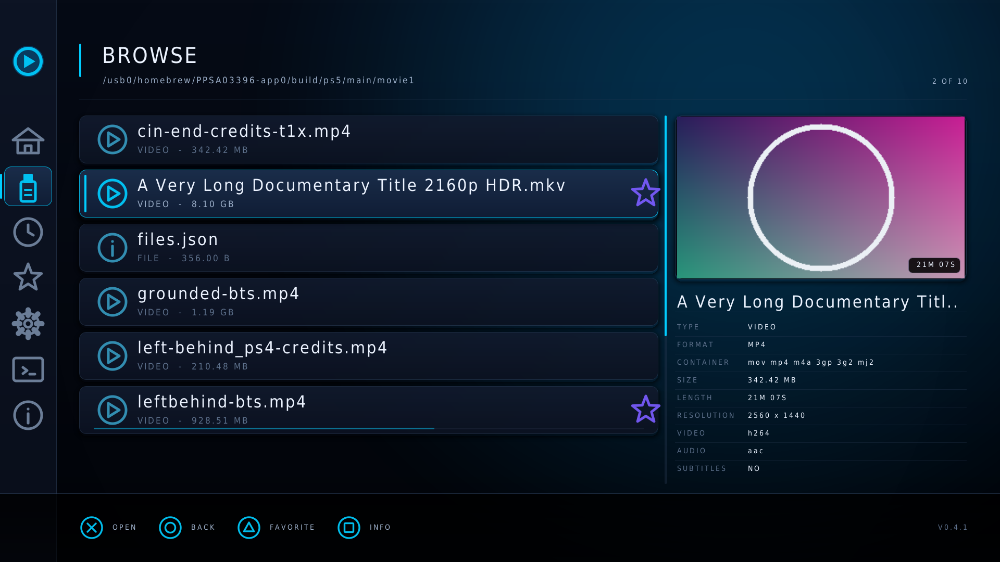
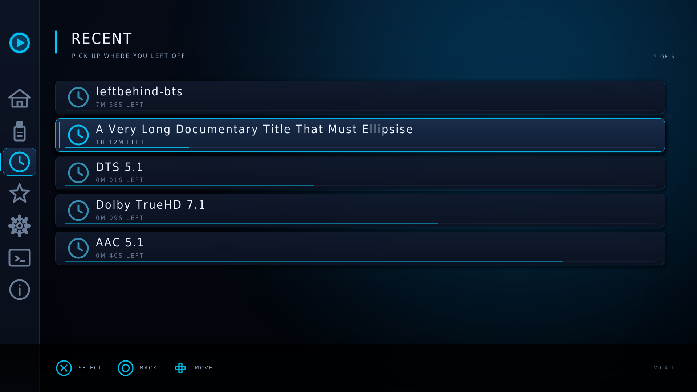
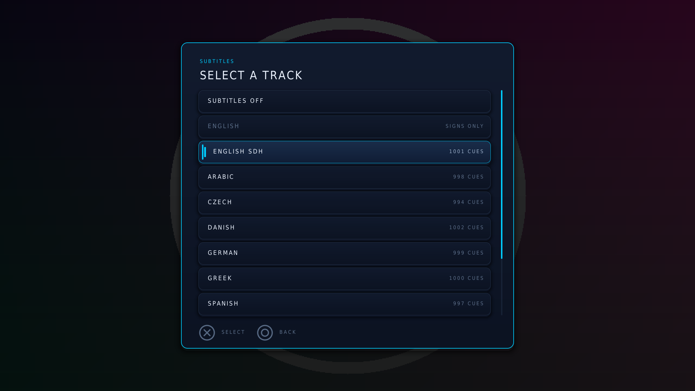
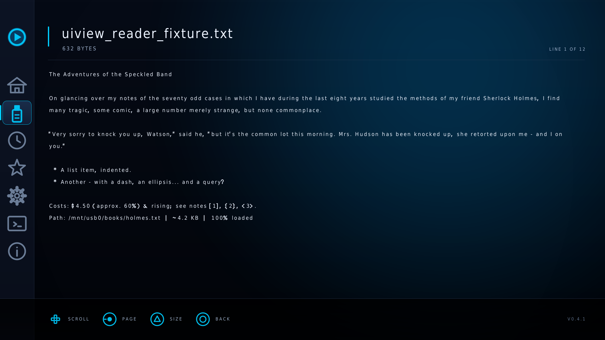
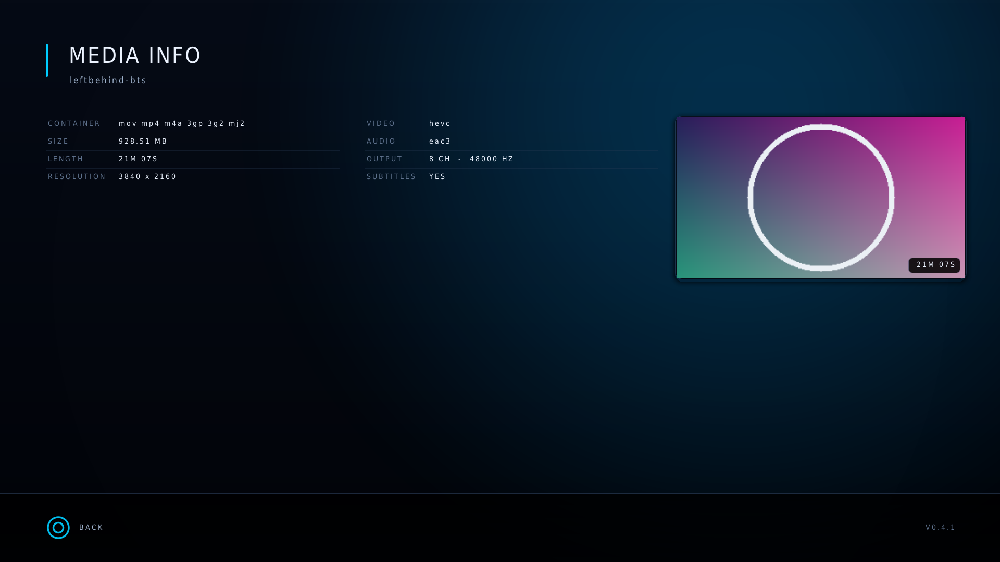
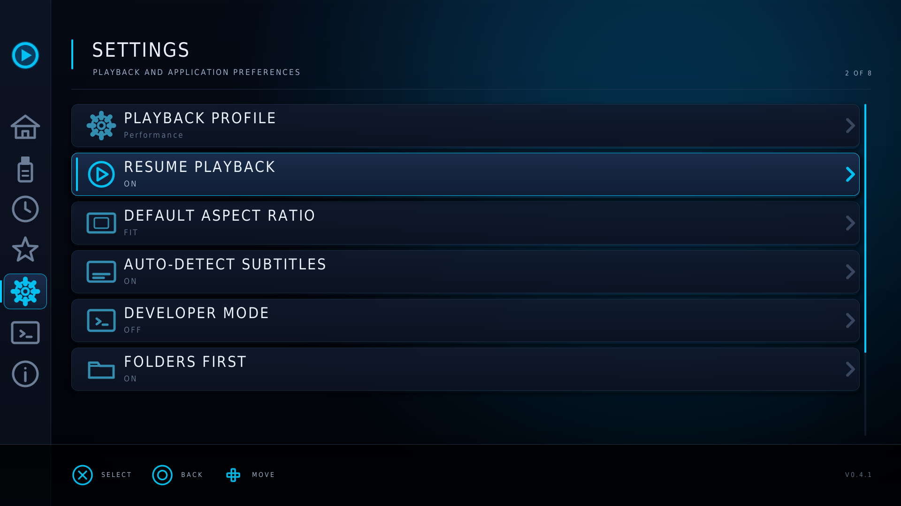

# EVO Player

**A media player for jailbroken PS5 on firmware 12.70.**

Plays your video off a USB stick, with surround sound, subtitles, resume, and
an interface built for a controller and a television rather than a mouse.



---

## Install

Grab the latest **[release](https://github.com/sainsaji/EVO-PLAYER-PS5/releases/latest)**
and take either route:

**From the home screen** — download `EVOPlayer-*-homebrew.zip`, extract it to a
USB stick as `/homebrew/EVOPlayer/`, and launch it from the websrv launcher at
`http://<your-ps5>:8080`. Build the home-screen tile with
`./scripts/build-media-tile.sh --install` and it appears in the console's own
Media row, no browser needed.

**You will need**

- A PS5 on firmware **12.70**, jailbroken — the jailbreak must be re-run after
  every reboot
- `ps5-payload-elfldr` and `ps5-payload-websrv` running on the console
- A USB stick, formatted exFAT or FAT32, with your media on it

Put video in any folder on the stick. EVO Player reads `/mnt/usb0`.

---

## What it does

### Browse your library

Folders first, then A–Z. The inspector shows codec, resolution, size and
length before you commit to opening anything, and files you have started show
how far in you got.



Hold a direction to scroll, shoulder buttons to page, triggers to jump A–Z.
TRIANGLE favourites a file; SQUARE opens full details.

### Pick up where you left off

The launch screen leads with whatever you were last watching, and the shelf
below it holds the rest of your recent files with real cover art pulled from
the video itself.



### Subtitles, chosen by what is in them

Tracks are ranked by how many cues they actually contain, not by what the
metadata claims — so the real subtitle track is at the top and a signs-only
track is labelled as one instead of being picked by accident.



Press DOWN during playback. Language names come from the track's language code,
50 of them mapped. L2 and R3 nudge subtitle timing if a file is out of sync.

### Read text files

Open a `.txt`, `.log`, `.md`, `.nfo`, `.srt` or `.json` and it opens in a
reader rather than doing nothing.



D-pad scrolls, shoulders page, triggers jump a tenth of the file, TRIANGLE
changes text size and keeps your place. Curly quotes, em dashes and accented
letters are folded to what the font can draw, so text from the web reads
properly.

### Know what you are playing



### Make it yours



Four built-in themes, plus any `.theme` file you drop in `/mnt/usb0/evo_themes`
— see [docs/theming.md](docs/theming.md). Navigation sounds and a lightbar
tinted to the theme, both of which can be turned off.

---

## Controls

| | Browsing | Playing |
|---|---|---|
| **CROSS** | open | pause / resume |
| **CIRCLE** | back | stop, after confirming |
| **TRIANGLE** | favourite | view mode: fit / fill / stretch |
| **SQUARE** | file details | — |
| **D-pad / stick** | move, hold to scroll | — |
| **LEFT** | open the side rail | — |
| **DOWN** | — | choose a subtitle track |
| **L1 / R1** | page | skip a chapter, or ±60s |
| **L2 / R2** | jump A–Z | subtitle timing |
| **L3** | — | save a screenshot to USB |

CIRCLE asks before it stops playback — it is the same button that means "back"
everywhere else, and it used to throw away your place in the file on one press.

---

## Good to know

- **Resume** is offered when you reopen a file you did not finish.
- **Screenshots** go to the USB stick. The websrv `/fs` endpoint is read-only,
  so delete them from the console's own web terminal or by pulling the drive.
- **4K** plays natively for 8-bit SDR up to 30fps. HDR and 10-bit are not
  supported yet.
- Media stays on your stick. Nothing is copied to the console, and nothing
  leaves your network.

---

## Building it yourself

Everything builds in a pinned Docker container — no toolchain to install:

```bash
git clone https://github.com/sainsaji/EVO-PLAYER-PS5
cd EVO-PLAYER-PS5
echo "PS5_HOST=192.168.0.10" > .env      # your console's IP

docker compose build                     # one-time, ~10 min
docker compose run --rm ps5-dev ./scripts/build-evoplayer.sh
```

The full setup — Windows host, the SDK, FFmpeg, deployment, and why each
version is pinned where it is — is in **[docs/building.md](docs/building.md)**.

The interface can be rendered on your PC without a console at all, which is how
most of it was built:

```bash
./tools/uiview.sh --all          # every screen, to output/uiview/
```

Every screenshot on this page is one of those renders.

### Documentation

| | |
|---|---|
| [docs/building.md](docs/building.md) | full build and deploy guide |
| [docs/architecture.md](docs/architecture.md) | how the code is laid out |
| [docs/ui-handoff.md](docs/ui-handoff.md) | the UI layer, and working on it |
| [docs/converter-perf.md](docs/converter-perf.md) | the video path, measured |
| [docs/theming.md](docs/theming.md) | writing a `.theme` file |
| [docs/tooling.md](docs/tooling.md) | the scripts, and what each is for |
| [CHANGELOG.md](CHANGELOG.md) | what changed, per release |

---

## Credits and licence

Forked from [ProsperoPlayer](https://github.com/KINGDKAK/ProsperoPlayer) by
KINGDKAK, and licensed **GPL-3.0-or-later** — see [COPYRIGHT.md](COPYRIGHT.md).

- [ps5-payload-dev](https://github.com/ps5-payload-dev) (John Törnblom) — SDK,
  elfldr, websrv, pacbrew-repo
- [KINGDKAK](https://github.com/KINGDKAK) — ProsperoPlayer
- [zecoxao/sce_symbols](https://github.com/zecoxao/sce_symbols) — NID database

EVO Player is independent homebrew, **not affiliated with Sony or
PlayStation**. Use at your own risk, with media you own. No Sony code, binaries
or keys are included in or required by this repository.
