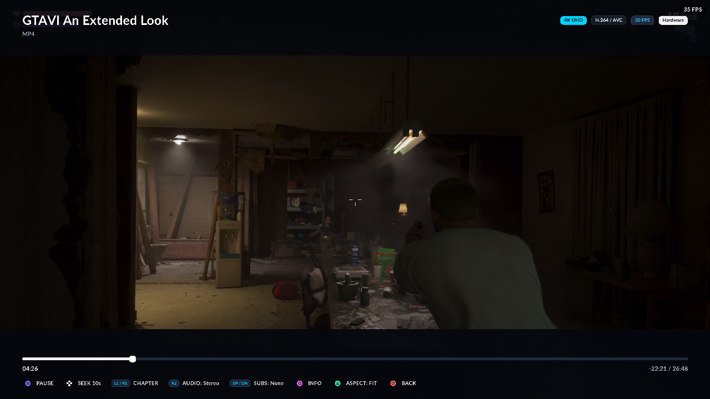

# EVO Player

**A media player for jailbroken PS5.**

Plays video from a USB drive or internal storage. Video decodes on the console's own hardware decoder at up to 4K with 10-bit HDR, the interface renders on the GPU, and everything is built for the DualSense and a television across the room.


---

## Installation

EVO Player is a **game-category app module** (`PPSA99039`). It installs as a single `.ffpfsc` image and launches from the **Games** row, like any other title.

### Prerequisites

- A jailbroken PS5. Developed and verified on firmware **12.70** — other
  firmwares are not known to fail, they are simply untested, so treat
  anything else as unverified rather than unsupported.
- **ShadowMountPlus** on the console, to mount the app image.
- An FTP server on the console (the usual jailbreak payloads provide one on port `2121`).
- *(For USB playback)* a USB stick formatted **exFAT** or **FAT32**, plugged in at `/mnt/usb0`.

### Install

1. Download **`PPSA99039.ffpfsc`** from the latest **[GitHub Release](https://github.com/sainsaji/EVO-PLAYER-PS5/releases/latest)**.
2. Copy it to `/data/homebrew/` on the console over FTP.
3. ShadowMountPlus mounts and auto-launches it on the file change. Otherwise launch **EVO Player** from the **Games** row.

> [!IMPORTANT]
> **Close EVO before installing a new version.** The app slot stays resident, and replacing the image underneath a running instance — or stacking a second launch on top of one — can panic the console. Use **Settings → System & Diagnostics → QUIT EVO** to release the decoders and GPU, then close it from the switcher.

---

## Features

### Hardware video decode

Video decodes on the console's own `sceVideodec2` decoder — **H.264, HEVC and VP9 at up to 4K** — with resident per-codec decoders created once at boot. Clips outside what the hardware accepts fall back to FFmpeg automatically.

**10-bit HDR** is supported with HDR10 (PQ) and HLG tone mapping over a BT.2020 matrix, and the VideoOut mode switches per frame to match the source.



#### Verified formats

Every codec below was played on a real console and checked frame by frame.
"Hardware" means the console's `sceVideodec2` decoder; "software" means the
FFmpeg fallback, which runs comfortably at 1080p.

| Codec | Up to | Decoder |
|---|---|---|
| H.264 / AVC | 4K 60fps | hardware |
| H.264 High 10 | 1080p | software |
| HEVC / H.265 8-bit | 4K 60fps | hardware |
| HEVC 10-bit (HDR10 / PQ and HLG) | 1080p 60fps | hardware |
| VP9 | 4K | hardware |
| VP9 Profile 2 (10-bit) | 1080p | software |
| AV1 | 1080p | software (dav1d) |
| VP8 | 1080p | software |
| MPEG-2 | 1080p | software |

Audio: AAC, AC-3, E-AC-3, Dolby TrueHD, DTS, Opus, Vorbis, FLAC and LPCM.
Surround sources open a full 7.1 output port rather than being folded
down; stereo sources play as stereo.

**4K is hardware-only.** Codecs the console cannot decode in hardware — AV1, and
HEVC 10-bit above 1080p — are limited to 1080p, and a 4K file in one of those
formats reports that it is unsupported rather than trying and failing. The PS5
gives a homebrew title roughly 180 MB of working memory, and a single 4K frame
plus a decoder's reference queue does not fit.

### GPU-rendered interface

The whole UI is submitted to the GPU as real draw calls through bare-metal `sceAgc`, at the panel's own resolution rather than a fixed 1080p surface. Menus hold 60 fps and only redraw when something actually changes, so an idle screen costs nothing.

### Browse USB & internal storage

Browse `/mnt/usb0` and `/data` with a live metadata inspector — codec, resolution, size, duration — and a thumbnail on every card.

> [!NOTE]
> **Emby is turned off in 0.10.0** while it is reworked. The integration is
> still in the tree and still builds; it is only unreachable from the UI, and
> comes back on in a later release.


### Surround Sound Studio (5.1 & 7.1)

A 360° top-down sound stage for checking a multichannel setup.

- Real hardware output over PS5 8-channel audio (`S16_8CH`).
- 50 ms attack/decay envelopes, so tests do not pop.
- Per-speaker tones for `FL`, `FC`, `FR`, `LFE`, `SL`, `SR`, `BL`, `BR`.
- Automated 5.1 and 7.1 sequences, plus a continuous 360° rotation sweep.
- 5.1 mode hides the side speakers and remaps D-pad navigation to match.


### Subtitles

Tracks are ranked by real cue counts rather than claimed metadata. Default size (`SMALL` / `MEDIUM` / `LARGE`) persists in Settings, and sync can be nudged live with **L2 / R2**.


### On-screen keyboard

A controller-friendly keyboard for server addresses, ports, usernames and passwords, with lower/upper case, digits and symbols. **□** backspace, **△** done, **○** cancel.


### Text reader

Opens `.txt`, `.log`, `.md`, `.nfo`, `.json` and subtitle files directly, with adjustable text size.


### Settings & themes

Grouped sub-menus for Playback & Video, Subtitles, Interface & Controls, and System & Diagnostics — including developer tools with a live performance overlay. Five colour themes: Midnight, Carbon, Ember, Aurora, and a USB-supplied theme from `/mnt/usb0/evo_themes`.


---

## Controls

| Button | In menus & browser | During playback | In keyboard |
|---|---|---|---|
| **CROSS ✕** | Select / open | Pause / resume | Type character |
| **CIRCLE ○** | Back | Stop (with prompt) | Cancel |
| **TRIANGLE △** | Toggle favourite | Aspect: Fit / Fill / Stretch | Done |
| **SQUARE □** | File details | — | Backspace |
| **D-Pad / Stick** | Move focus, hold to scroll | Scrub | Move cursor |
| **LEFT** | Open the navigation rail | — | — |
| **DOWN** | — | Subtitle track picker | — |
| **L1 / R1** | Page scroll | Chapter skip / ±60 s | Shift / symbols |
| **L2 / R2** | Jump alphabetically | Subtitle sync ±50 ms | — |
| **L3 / R3** | Screenshot | Screenshot | — |

Screenshots are written to `/mnt/usb0/evo_shot_NNN.bmp`, falling back to the data root if USB is not writable.

---

## Building from source

Everything builds in the pinned Docker toolchain.

```bash
git clone https://github.com/sainsaji/EVO-PLAYER-PS5
cd EVO-PLAYER-PS5
echo "PS5_HOST=192.168.0.10" > .env      # your console's IP

docker compose build
```

Build and deploy the app module — this is the only hardware path:

```bash
docker compose run --rm ps5-dev bash -lc '
  ./scripts/package-app.sh --ffpfsc
  ./scripts/deploy-app.sh --ffpfsc'
```

`deploy-app.sh` refuses to install over an EVO that has been launched since the last deploy. Close it from the switcher first, or pass `--force` if you know the slot is free.

Render every UI screen on your PC, with no console involved:

```bash
./tools/uiview.sh --all                  # -> output/uiview/
./tools/uiplay.sh                        # contact sheet of all screens
```

Run the test suite:

```bash
docker compose run --rm ps5-dev ./tests/run_tests.sh
```

---

## Documentation

| Document | Purpose |
|---|---|
| [docs/building.md](docs/build/building.md) | Build environment, SDK, FFmpeg, packaging |
| [docs/tooling.md](docs/build/tooling.md) | Every script, launch safety, screenshots, klog |
| [docs/architecture.md](docs/architecture/architecture.md) | Layer boundaries and module structure |
| [docs/rmlui-integration-guide.md](docs/ui/rmlui-integration-guide.md) | The RmlUi interface layer |
| [docs/evo-pro/agc-bare-metal-ui.md](docs/evo-pro/agc-bare-metal-ui.md) | GPU rendering on bare-metal `sceAgc` |
| [docs/evo-pro/native-decode-plan.md](docs/evo-pro/native-decode-plan.md) | Hardware decode via `sceVideodec2` |
| [docs/addons-emby-nuvio.md](docs/addons/addons-emby-nuvio.md) | Emby and streaming add-ons |
| [docs/theming.md](docs/ui/theming.md) | Theme format and tokens |
| [CHANGELOG.md](CHANGELOG.md) | Release history |

---

## Credits & License

Forked from [ProsperoPlayer](https://github.com/KINGDKAK/ProsperoPlayer) by KINGDKAK and licensed under **GPL-3.0-or-later** (see [COPYRIGHT.md](COPYRIGHT.md)).

- [ps5-payload-dev](https://github.com/ps5-payload-dev) (John Törnblom) — SDK and toolchain
- [KINGDKAK](https://github.com/KINGDKAK) — ProsperoPlayer
- [zecoxao/sce_symbols](https://github.com/zecoxao/sce_symbols) — NID symbol database

*EVO Player is independent homebrew software and is not affiliated with, endorsed by, or associated with Sony Interactive Entertainment. All PlayStation trademarks belong to their respective owners.*
