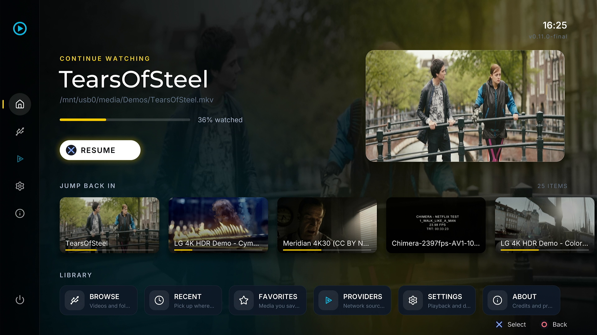
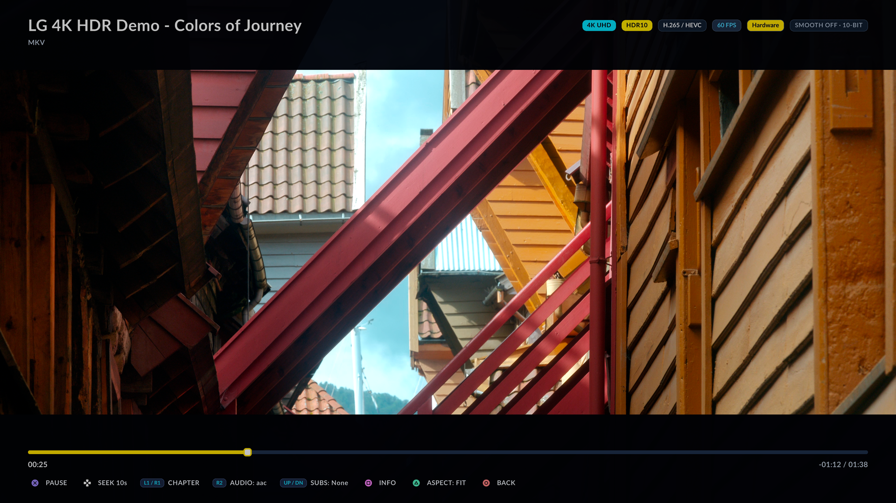
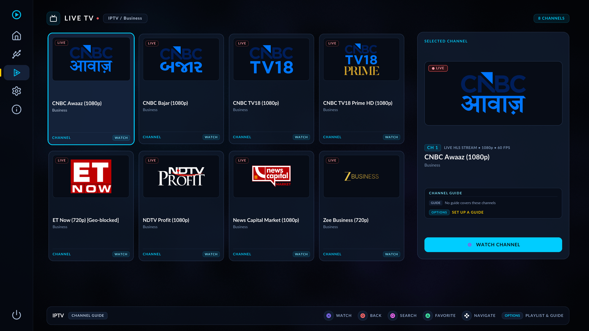
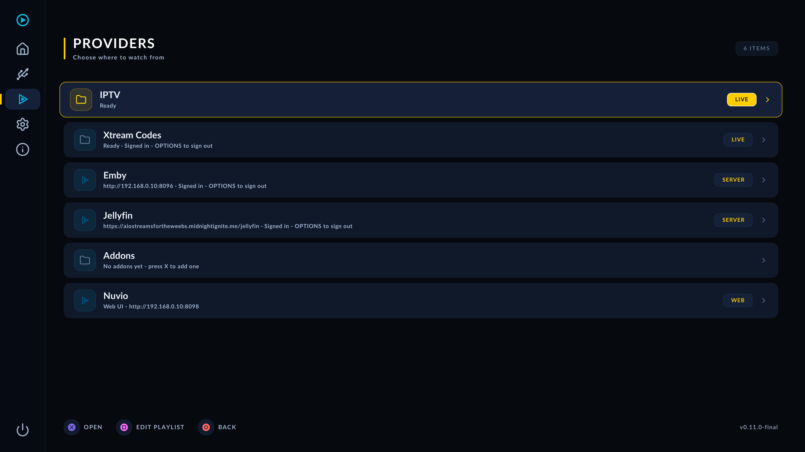
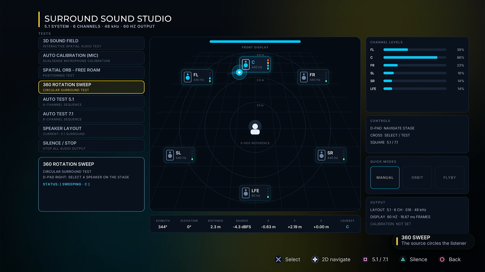
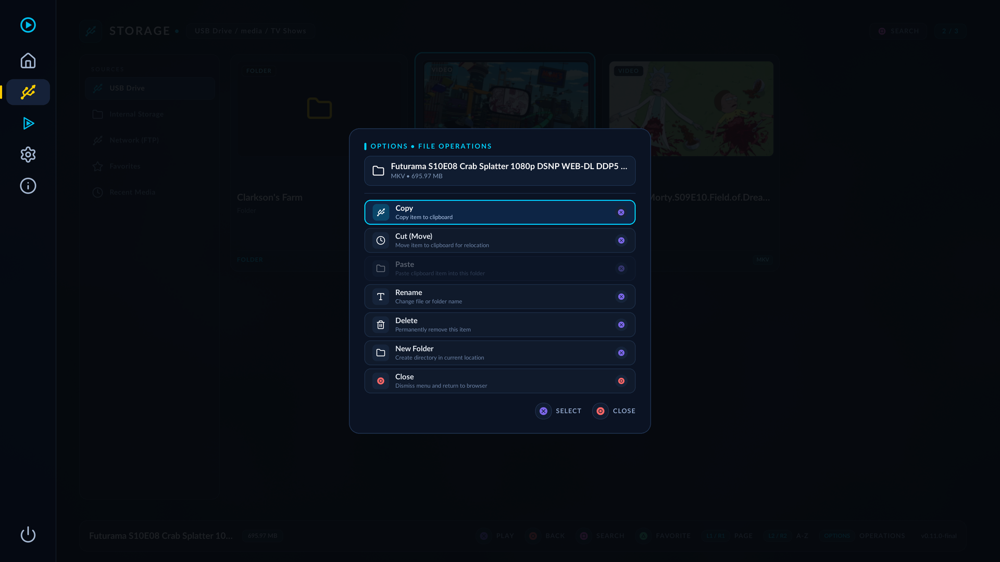
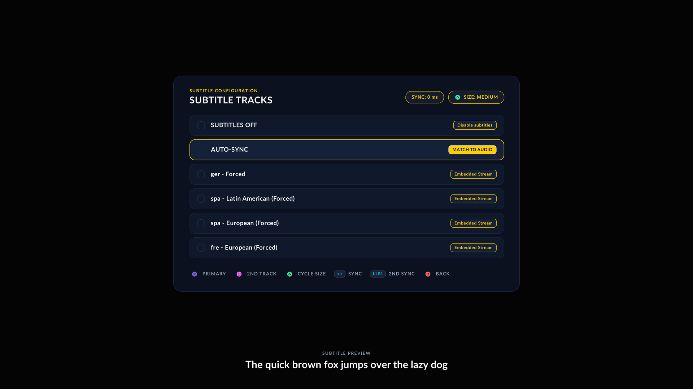
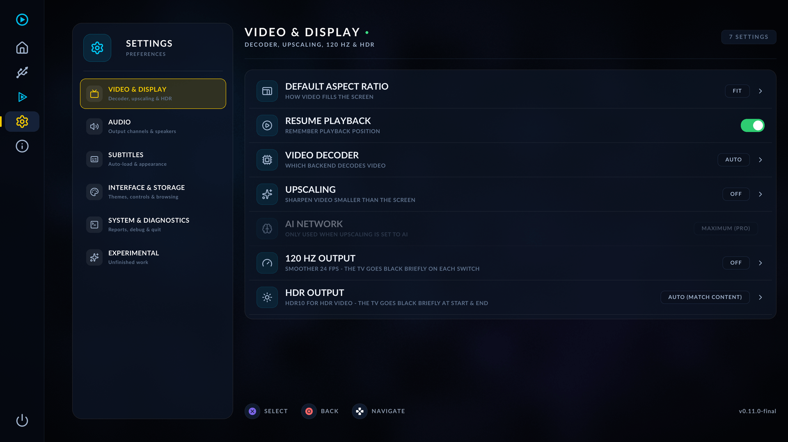

# EVO Player

**A native media player for jailbroken PlayStation 5.**

Plays video from USB drives, internal storage, network shares (FTP), Live TV (IPTV / M3U), and media servers (Emby, Jellyfin, Stremio). Video decodes on the console's own hardware decoder at up to 4K with 10-bit HDR and Dolby Vision, the interface renders directly on the GPU via bare-metal `sceAgc`, and everything is built from the ground up for the DualSense controller and the big screen.



**[Download the latest release](https://github.com/sainsaji/EVO-PLAYER-PS5/releases/latest)** · **[Install from ProsperoStore](https://github.com/blackbearreloaded/ProsperoStore)** · **[Join the Discord](https://discord.gg/MyNnCWNU5)**

---

## What's New in v0.11.0

- **Live TV & IPTV:** Plug in a USB stick with an M3U playlist or enter a URL. Full channel guide with XMLTV EPG (NOW / NEXT), 2×4 channel logo grid, L1/R1 fast paging, and Xtream Codes accounts.
- **Media Servers (Emby, Jellyfin, Stremio):** Native EVO screens for libraries, poster grids, seasons, episodes, and Continue Watching. Supports Jellyfin Quick Connect and multi-version stream selection.
- **Real-Time AI Upscaling:** Sub-4K media is upscaled in real time using AMD FSR 1 spatial sharpening (`Sharp`) or Anime4K convolutional neural networks (`AI` — Standard, Large, and Maximum for PS5 Pro).
- **Dolby Vision Profile 5 & AV1:** Reshaped on the GPU from the RPU for accurate color tonemapping. AV1 hardware/software decode support up to 4K 10-bit.
- **Surround Sound Studio & DualSense Auto-Calibration:** Interactive 2.5D soundstage with sound orb navigation, discrete 5.1 & 7.1 Linear PCM output, and automatic room acoustic calibration using the DualSense controller microphone.
- **Built-in File Manager & Full FTP Support:** Press Options on any file or folder to copy, move, rename (with the on-screen virtual keyboard), or delete, with live transfer speed (MB/s) and ETA. Features **automatic detection of the PS5 internal FTP server** (`127.0.0.1:2121`), high-speed loopback file delegation, and easy mounting of remote FTP/NAS shares right from the sidebar.
- **Subtitles & Auto-Sync:** Acoustic speech auto-sync, concurrent dual subtitle tracks (bottom primary + top secondary), and on-the-fly timing adjustment via DualSense trackpad swipe.
- **120 Hz Output & Motion Smoothing:** HDMI 2.1 120 Hz output for judder-free 5:5 pulldown on 24 fps cinema content, plus experimental 24 → 60 fps GPU motion smoothing.

---

## Installation

EVO Player is a **game-category app module** (`PPSA99039`). It installs as a single `.ffpfsc` image and launches from the **Games** row, like any other title.

### Prerequisites

- A jailbroken PS5 on any firmware **below 13.60**. Developed and tested on 12.70.
- **ShadowMountPlus** on the console to mount and manage the app image.
- An FTP server on the console (the usual jailbreak payloads provide one on port `2121`).
- *(For USB playback)* a USB drive formatted **exFAT** or **FAT32**, plugged into `/mnt/usb0`.

### Easiest: install from ProsperoStore

**[ProsperoStore](https://github.com/blackbearreloaded/ProsperoStore)**, the native PS5 app store for the [homebrew.page](https://homebrew.page) catalog, installs and updates EVO Player from the console itself, with no PC and no FTP. Find EVO Player in the store, install it, and launch it from the **Games** row.

### Install Steps (manual)

1. Download **`PPSA99039.ffpfsc`** from the latest **[GitHub Release](https://github.com/sainsaji/EVO-PLAYER-PS5/releases/latest)**.
2. Copy it to `/data/homebrew/` on the console over FTP.
3. ShadowMountPlus mounts and auto-launches it on file change. Otherwise launch **EVO Player** from the **Games** row.

> [!IMPORTANT]
> **Close EVO before installing a new version.** The app slot stays resident, and replacing the image underneath a running instance — or stacking a second launch on top of one — can panic the console. Use **QUIT EVO** (from the nav rail or **Settings → System & Diagnostics**) to release the decoders and GPU, then close it from the switcher.

---

## Features

### Hardware Video Decode, HDR & Dolby Vision

Video decodes on the console's own `sceVideodec2` hardware decoder — **H.264, HEVC and VP9 at up to 4K** — with resident per-codec decoders created once at boot. Clips outside hardware limits fall back to FFmpeg automatically.

- **10-bit HDR (HDR10 / PQ and HLG):** Decodes on the hardware decoder. **Settings → Video & Display → HDR OUTPUT** chooses how it is presented: **Auto** matches the display, **Off** tone-maps to SDR using a BT.2390 curve (BT.2020 → BT.709).
- **Dolby Vision Profile 5:** Correct IPT color tonemapping reshaped on the GPU from the RPU data, eliminating magenta/green discoloration.
- **AV1 Support:** Decodes AV1 up to 4K 10-bit via optimized libdav1d.



#### Video Codecs

| Codec | Decoder | Up to | Verified |
|---|---|---|---|
| **HEVC / H.265 Main (8-bit)** | hardware (`sceVideodec2`) | 4K 60fps, real time | yes |
| **HEVC Main 10 (HDR10 & HLG)** | hardware (`sceVideodec2`) | 4K 60fps, real time | yes |
| **Dolby Vision Profile 5** | hardware + GPU tonemap | 4K 60fps, real time | yes |
| **H.264 / AVC High** | hardware (`sceVideodec2`) | 4K 30fps / 1080p 60fps | yes |
| **VP9 Profile 0 & Profile 2** | hardware (`sceVideodec2`) | 4K (Profile 0) / 1080p (Profile 2) | yes |
| **AV1 (10-bit)** | software (libdav1d) | 4K, real time | yes |
| **MPEG-2, MPEG-4 Part 2, VC-1** | software | 1080p | yes |

#### Audio Codecs & Surround Output

Multichannel sources decode to discrete **Linear PCM 5.1 & 7.1** over HDMI, or fold down cleanly to stereo for headphones and TV speakers.

| Codec | Decoder | Channels | Verified |
|---|---|---|---|
| **Linear PCM** | hardware / passthrough | 2.0, 5.1, 7.1 discrete | yes |
| **Dolby TrueHD** | software decode | 5.1, 7.1 | yes |
| **Dolby Digital (AC-3) & E-AC-3** | software decode | 5.1, 7.1 (Atmos bed) | yes |
| **DTS-HD Master Audio & DTS core** | software decode | 5.1, 7.1 | yes |
| **DTS:X (bed)** | software decode | 7.1.4 | yes |
| **FLAC & ALAC** | software decode | Up to 192 kHz / 24-bit (5.1, 7.1) | yes |
| **AAC / AAC-LATM / MP3 / Opus** | software decode | Stereo & multichannel | yes |

---

### Real-Time AI Upscaling

Anything below 4K can be upscaled in real time using console compute shaders:

- **Sharp (AMD FSR 1):** Edge-adaptive directional spatial reconstruction filter. Extremely lightweight (~1.2 ms frame overhead), ideal for broadcast TV, sports, and live-action films.
- **AI (Anime4K Neural Networks):** Deep convolutional neural network (CNN) inference running live on the GPU. Reconstructs sharp linework and fine textures.
  - **Standard:** Balanced neural pass with minimal overhead.
  - **Large:** Multi-pass refinement for animation and clean digital content.
  - **Maximum:** Extreme multi-stage network inference (optimized for PS5 Pro).

Select your preferred engine under **Settings → Video & Display → Upscaling**. The on-screen display (OSD) shows real-time badge confirmation during playback.

---

### Live TV & IPTV

Full-featured IPTV playback built right into EVO's native screens:

- **Automatic M3U Discovery:** Drop an `iptv.m3u` file onto a USB drive and EVO finds it automatically, or specify a remote URL.
- **XMLTV Channel Guide:** Electronic program guide (EPG) displaying current (`NOW`) and upcoming (`NEXT`) broadcast schedules with channel logos.
- **Navigation:** 2×4 channel logo grid with fast L1 / R1 paging and real-time search.
- **Xtream Codes API:** Native account support for Live Streams, VOD, and Series categories.
- **Live Stream Switcher:** Press **R2** during playback to swap video streams, quality renditions, or audio tracks on the fly.



---

### Media Servers: Emby, Jellyfin & Stremio

Connect your media servers directly to EVO without leaving the native interface:

- **Native Libraries:** Poster grids, Continue Watching, TV series, seasons, and episode tracking. Watched status and playback positions sync back to the server.
- **Jellyfin Quick Connect:** Sign in instantly using a 6-digit code without typing passwords on a controller.
- **LAN Discovery:** Automatically finds Emby and Jellyfin servers on your local network.
- **Multi-Version Selector:** If a movie or episode has multiple releases (e.g. 4K HDR Remux, 1080p SDR, Web-DL), EVO lets you choose which version to play.
- **Embedded Web View:** Quick web access to Emby, Jellyfin, and Nuvio beside the navigation rail.



---

### Surround Sound Studio & DualSense Auto-Calibration

A 2.5D visual soundstage (**Settings → Audio → Surround Sound Test**) to configure and test multichannel speaker setups:

- **Interactive Sound Stage:** Free-roam 3D sound orb controllable via the analog stick, trackpad, or D-pad.
- **Real-Time VU Meters & Test Chirps:** Individual channel tones for `FL`, `FC`, `FR`, `LFE`, `SL`, `SR`, `BL`, `BR`.
- **DualSense Mic Auto-Calibration:** Place the DualSense controller at your primary listening position and let EVO emit swept-sine acoustic chirps. The controller's microphone array captures room impulses to calculate:
  - Precise speaker distance trims (cm / ms).
  - Sub-millisecond phase arrival alignment.
  - Channel gain loudness balance.
- **Clean Stereo Downmix:** Phase-accurate folding of 5.1 and 7.1 content to 2.0 stereo under **Settings → Audio → Output Channels**.



---

### File Operations & FTP Network Storage

Manage your storage directly on the PS5 with native file operations and integrated FTP:

- **File Manager:** Press **OPTIONS** on any file or folder to Copy, Cut, Paste, Rename (using the on-screen virtual keyboard), Delete, or create folders.
- **Asynchronous Transfers:** File operations run on a dedicated background thread with real-time transfer speed (MB/s), bytes copied, and remaining ETA.
- **Instant Filter Chips:** Press **Up** from the top row to filter the current folder by video, audio, or images without rescanning the drive.
- **Automatic PS5 Internal FTP Detection:** EVO Player automatically detects and connects to the console's resident jailbreak FTP payload on loopback (`127.0.0.1:2121`). Pre-configured as **PS5 Local FTP** in the browser sidebar, giving you immediate access to explore and manage the entire console filesystem (`/`) without typing IP addresses or credentials.
- **High-Speed Loopback Delegation:** Large internal file transfers (>64 MB) automatically stream through the loopback FTP daemon to bypass per-process application write throttling, sustaining full drive speeds (~80+ MB/s).
- **Remote FTP / NAS Mounting:** Add remote FTP servers from your home network in the sidebar to stream media directly or transfer files between your PC/NAS and console without leaving the sofa.



---

### Subtitles & Audio Auto-Sync

- **Experimental Audio Auto-Sync:** Analyzes spoken audio in real time to calculate acoustic timing offsets and synchronize subtitle tracks automatically.
- **Concurrent Dual Subtitles:** Display two subtitle languages simultaneously — primary at the bottom, secondary at the top of the screen.
- **Live Touchpad Sync Nudge:** Swipe horizontally or click left/right on the DualSense trackpad (or press **L2**) during playback to nudge timing in ±50 ms increments without pausing.
- **Broad Format Support:** Styled ASS / SSA with full styling and positioning, SRT, SubRip, and WebVTT.



---

### 120 Hz Output & Motion Smoothing

- **120 Hz High Frame Rate (HDMI 2.1):** Enables clean 5:5 pulldown for 24.000 / 23.976 fps cinema film content, eliminating 3:2 pulldown judder. Options: Off, Auto, or Playback Only under **Settings → Video & Display**.
- **Experimental Motion Smoothing:** Real-time 24 → 60 fps frame interpolation synthesised on the GPU under **Settings → Experimental**.

---

### GPU-Rendered Interface (`sceAgc`)

The entire user interface is rendered on the GPU through bare-metal `sceAgc` at the panel's native resolution:
- Locked 60 fps navigation with minimal frame times.
- Renders only when state changes, maintaining near-zero idle GPU load.
- Five built-in color themes (Midnight, Carbon, Ember, Aurora) plus custom USB themes (`/mnt/usb0/evo_themes`).



---

## Controls Reference

| Button | In Menus & File Browser | During Playback | On-Screen Keyboard |
|---|---|---|---|
| **CROSS ✕** | Select / Open | Play / Pause | Type character |
| **CIRCLE ○** | Back | Stop playback (with prompt) | Cancel |
| **TRIANGLE △** | Toggle favourite / Web view | Cycle Aspect Ratio (Fit / Fill / Stretch) | Done / Submit |
| **SQUARE □** | File details / Provider settings | Media Info (Codec, Resolution, Decoder) | Backspace |
| **OPTIONS** | File operations (Copy, Move, Rename, Delete) | Playback settings menu | Space |
| **D-Pad / Left Stick** | Move focus, hold to scroll | Scrub seek bar (hold for high-speed) | Move cursor |
| **LEFT** | Open navigation rail | — | — |
| **UP** | Instant folder filter chips | Toggle OSD overlay | — |
| **DOWN** | — | Open subtitle track picker | — |
| **L1 / R1** | Page up / Page down | Chapter skip / ±60 s seek | Shift / Symbols |
| **L2 / R2** | Jump alphabetically (A–Z) | **L2:** Subtitle sync ±50ms<br>**R2:** Live stream quality & audio picker | — |
| **Trackpad Swipe** | — | Live subtitle sync offset nudge | — |
| **L3 / R3** | Take screenshot to `/mnt/usb0` | Take screenshot | — |

---

## Building from Source

Builds inside a pinned Docker toolchain:

```bash
git clone --recursive https://github.com/sainsaji/EVO-PLAYER-PS5
cd EVO-PLAYER-PS5
echo "PS5_HOST=192.168.0.10" > .env      # your console's IP

docker compose build
```

Package and deploy the app module:

```bash
docker compose run --rm ps5-dev bash -lc '
  ./scripts/package-app.sh --ffpfsc
  ./scripts/deploy-app.sh --ffpfsc'
```

*Note: `deploy-app.sh` requires EVO to be closed before updating. Use `--force` if the app slot is already cleared.*

Render UI screens on PC without hardware:

```bash
./tools/uiview.sh --all                  # Outputs to output/uiview/
./tools/uiplay.sh                        # Contact sheet of all screens
```

Run test suite:

```bash
docker compose run --rm ps5-dev ./tests/run_tests.sh
```

---

## Documentation

| Document | Purpose |
|---|---|
| [docs/building.md](docs/build/building.md) | Build environment, SDK, FFmpeg, packaging |
| [docs/tooling.md](docs/build/tooling.md) | Development scripts, deployment safety, screenshots, klog |
| [docs/architecture.md](docs/architecture/architecture.md) | Core architecture and module boundaries |
| [docs/codec-support.md](docs/codec-support.md) | Comprehensive codec, container, and hardware decoding matrix |
| [docs/rmlui-integration-guide.md](docs/ui/rmlui-integration-guide.md) | RmlUi interface layer integration |
| [docs/evo-pro/agc-bare-metal-ui.md](docs/evo-pro/agc-bare-metal-ui.md) | Bare-metal `sceAgc` GPU rendering |
| [docs/evo-pro/native-decode-plan.md](docs/evo-pro/native-decode-plan.md) | Hardware decode via `sceVideodec2` |
| [docs/addons/provider-architecture.md](docs/addons/provider-architecture.md) | Network providers and runtime UI bundles |
| [docs/theming.md](docs/ui/theming.md) | Theme tokens and styling specifications |
| [CHANGELOG.md](CHANGELOG.md) | Complete version history |

---

## Community

Questions, bug reports, feature requests and early test builds: join the **[EVO Player Discord](https://discord.gg/MyNnCWNU5)**. Many of 0.11.0's features started as requests there.

---

## Credits & License

Forked from [ProsperoPlayer](https://github.com/KINGDKAK/ProsperoPlayer) by KINGDKAK and licensed under **GPL-3.0-or-later** (see [COPYRIGHT.md](COPYRIGHT.md)).

If EVO helps your project, a credit mention would be great: a request, not a licence condition ([details](COPYRIGHT.md#credit-is-appreciated)).

- [ps5-payload-dev](https://github.com/ps5-payload-dev) (John Törnblom) — SDK and toolchain
- [KINGDKAK](https://github.com/KINGDKAK) — ProsperoPlayer
- [zecoxao/sce_symbols](https://github.com/zecoxao/sce_symbols) — NID symbol database
- [BlackBearReloaded](https://github.com/blackbearreloaded) — [ps5-homebrew-ui](https://github.com/blackbearreloaded/ps5-homebrew-ui), the UI kit EVO's interface is built on
- [mihawk-99](https://github.com/mihawk-99) — [PS5_VulkanTemplate](https://github.com/mihawk-99/PS5_VulkanTemplate), whose [1 GiB flexible-memory change](https://github.com/mihawk-99/PS5_VulkanTemplate/commit/04aa411deb9d9d12b40cc2afb479a328394da4ca) EVO's app module uses
- PS5 developers **Philow**, **sword** and **0xManuel** — for their help and research

*EVO Player is independent homebrew software and is not affiliated with, endorsed by, or associated with Sony Interactive Entertainment. All PlayStation trademarks belong to their respective owners.*
